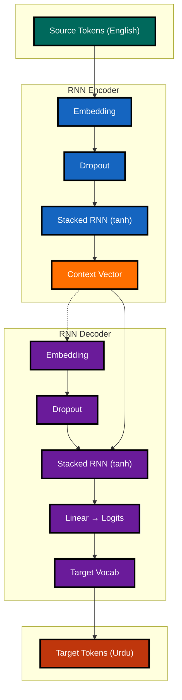
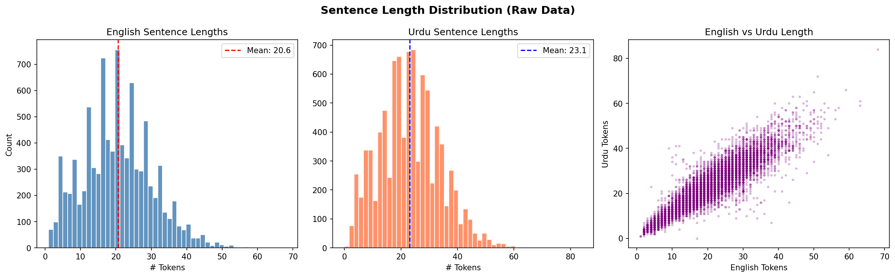
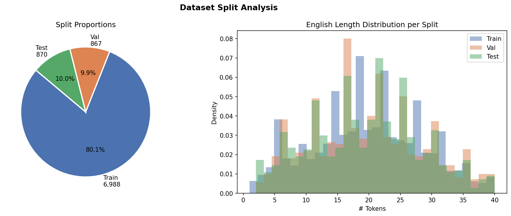
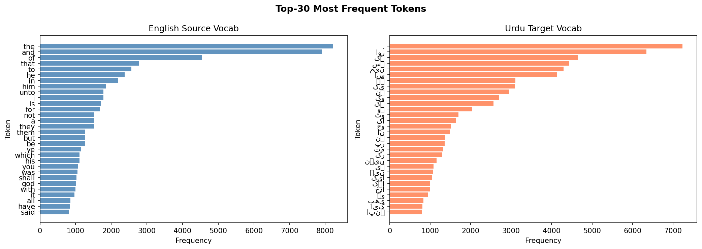
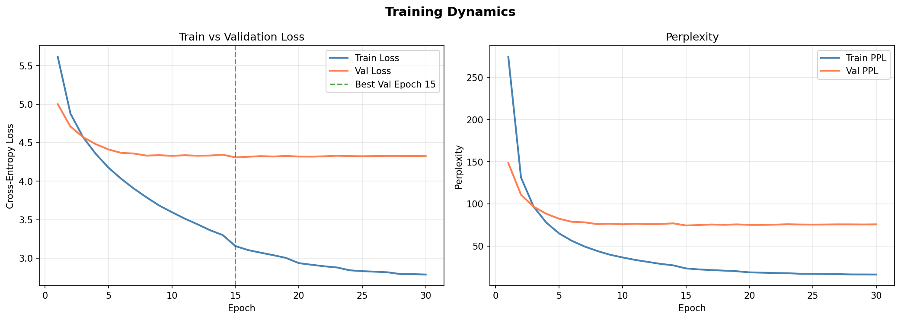
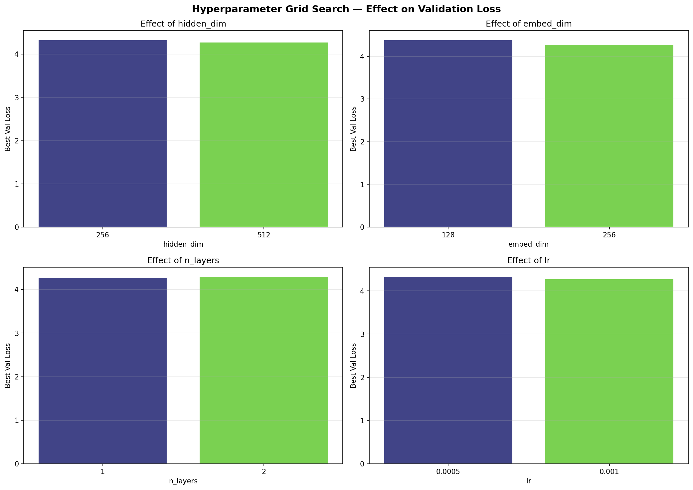
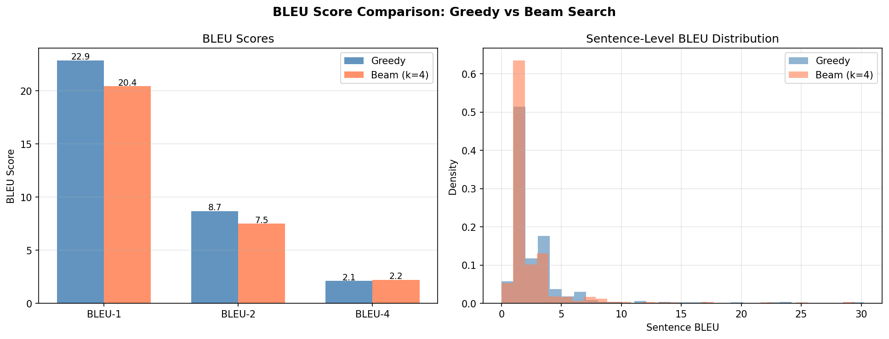
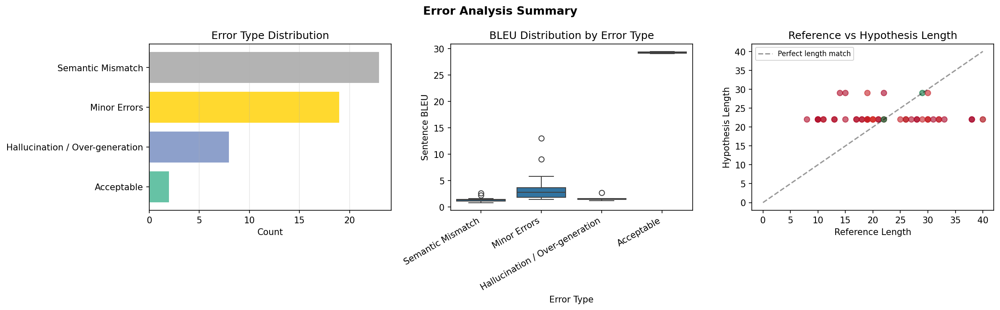

# ENG-URDU-NMT-RNN

Neural Machine Translation from English to Urdu using a vanilla RNN encoder–decoder (plain `nn.RNN` only — no LSTM, GRU, or Transformer). Built as a research assignment covering the full NMT pipeline: data cleaning, tokenization, model training, grid-search hyperparameter tuning, beam search decoding, BLEU evaluation, and qualitative error analysis.

---

## Project Structure

```
ENG-URDU-NMT-RNN/
├── data/
│   └── english_to_urdu_dataset.xlsx       # Raw parallel corpus (9,103 pairs)
├── notebooks/
│   ├── dataset_statistics.ipynb          # EDA and dataset statistics
│   └── english_to_urdu_nmt.ipynb         # Full NMT pipeline (Sections 1–11)
├── outputs/
│   ├── plots/                             # 7 PNG figures (lengths, split, vocab, training, grid, BLEU, error)
│   ├── checkpoints/                       # best_model.pt
│   └── results/                           # CSV tables + src_vocab.pkl, tgt_vocab.pkl
├── src/                                   # Optional source code
├── architecture.mmd                       # Mermaid diagram (vanilla RNN encoder–decoder)
├── .gitattributes
├── .gitignore
├── PROBLEM_STATEMENT.md                   # Assignment requirements
├── requirements.txt
└── README.md
```

---

## Model Architecture (Vanilla RNN Encoder–Decoder)

The notebook implements a **Seq2Seq** model with a vanilla RNN encoder and vanilla RNN decoder (no LSTM, GRU, or Transformer). The diagram below matches the code in `notebooks/english_to_urdu_nmt.ipynb`. Source: [`architecture.mmd`](architecture.mmd) (vibrant colors, black borders, thick stroke for visibility).



---

## Setup

**1. Create and activate a virtual environment**

```bash
python -m venv .venv
.venv\Scripts\activate        # Windows
# source .venv/bin/activate   # Linux / macOS
```

**2. Install dependencies**

```bash
pip install -r requirements.txt
```

**3. Place the dataset**

Put `english_to_urdu_dataset.xlsx` (columns: `eng`, `urdu`) at `data/english_to_urdu_dataset.xlsx`.

**4. Run the notebooks**

- **Dataset statistics:** `notebooks/dataset_statistics.ipynb` — EDA, missing/duplicate analysis, text stats.
- **NMT pipeline:** `notebooks/english_to_urdu_nmt.ipynb` — run all cells sequentially. Auto-detects GPU and creates `outputs/`.

> Designed for NVIDIA RTX 4060 Laptop GPU (8 GB VRAM). Default config: embedding 256, hidden 512, 2 RNN layers, batch size 64.

---

## Notebook Walkthrough & Cell Outputs

### Section 1 — Environment Setup

Detects GPU, sets global random seed (`SEED = 42`), and creates output directories.

```
Device: cuda
   GPU: NVIDIA GeForce RTX 4060 Laptop GPU
   VRAM: 8.6 GB

Environment ready.
```

---

### Section 2 — Data Loading & Exploration

Loads the XLSX file and prints a full dataset overview plus 5 random samples.

```
================================================================================
DATASET OVERVIEW
================================================================================
Shape          : (9103, 2)
Columns        : ['eng', 'urdu']
Total pairs    : 9,103
Memory usage   : 3.76 MB

Data types:
eng     object
urdu    object
```

**5 random samples (seed = 42):**

| # | English | Urdu |
|---|---------|------|
| 1 | and again they said alleluia and her smoke rose up for ever and ever | پھر دوسری بار انہوں نے ہلّلویاہ کہا اور اس کے جلنے کا دھواں ابدالآباد اٹھتا رہے گا ۔ |
| 2 | then paul stood up and beckoning with his hand said men of israel and ye that fear god give audience | پس پولس نے کھڑے ہوکر اور ہاتھ سے اشارہ کرکے کہا اے اسرائیلیو اور اے خدا ترسو سنو ۔ |
| 3 | there is difference also between a wife and a virgin… | بیاہی اور بے بیاہی میں بھی فرق ہے ۔ بے بیاہی خداوند کی فکر میں رہتی ہے… |
| 4 | then he called his twelve disciples together and gave them power and authority over all devils | پھر اس نے ان بارہ کو بلا کر انہیں سب بد روحوں پر اختیار بخشا ۔ |
| 5 | pilate therefore went forth again and saith unto them behold i bring him forth to you | پیلاطس نے پھر باہر جاکر لوگوں سے کہا کہ دیکھو میں اسے تمہارے پاس باہر لے آتا ہوں ۔ |

**Duplicate & missing analysis:**

```
MISSING VALUES ANALYSIS
eng     0
urdu    1
Total missing: 1

DUPLICATE ROWS ANALYSIS
Total duplicate rows   : 9
Percentage duplicates  : 0.10%
```

---

### Section 3 — Data Preprocessing

Separate pipelines for English (lowercasing, punctuation normalization, URL removal, character filtering) and Urdu (Urdu punctuation mapping: `۔→.`, `،→,`, `؟→?`, zero-width character removal, bracket annotation stripping). Sequences are capped at the 97th percentile length to keep GPU memory manageable.

```
Preprocessing in progress...
Nulls after English preprocessing : 0
Nulls after Urdu preprocessing    : 7
Rows removed as duplicates        : 10

97th percentile English length : 40
97th percentile Urdu length    : 44

Final cleaned dataset size : 8,725 pairs
Saved: outputs/results/cleaned_dataset.csv
```

**5 cleaned samples:**

```
ENG : they say unto him why did moses then command to give a writing of divorcement
URDU: انہوں نے اس سے کہا پھر موسی نے کیوں حکم دیا ہے کہ طلاقنامہ دے کر چھوڑ دی جائے

ENG : now about the midst of the feast jesus went up into the temple and taught
URDU: اور جب عید کے آدھے دن گزر گئے تو یسوع ہیکل میں جاکر تعلیم دینے لگا .

ENG : tom can fix the heater.
URDU: ٹام ہیٹر ٹھیک کر سکتا ہے.

ENG : my mother has made me what i am today.
URDU: میں آج جو کچھ ہوں, اپنی ماں کی وجہ سے ہوں.
```



---

### Section 4 — Train–Validation–Test Split

80/10/10 split on **unique source sentences** (by `eng_clean`) to guarantee zero overlap across partitions. Fixed `random_state=42`.

```
============================================================
DATASET SPLIT SUMMARY
============================================================
Training   : 6,988 pairs  (80.1%)
Validation :   867 pairs   (9.9%)
Test       :   870 pairs  (10.0%)
Total      : 8,725

Overlap checks (0 = no overlap):
  Train ∩ Val  : 0
  Train ∩ Test : 0
  Val ∩ Test   : 0
No overlap between any splits.
```



---

### Section 5 — Tokenization & Vocabulary Construction

Word-level tokenization (whitespace split) with `min_freq = 2`. Vocabularies are built on the **training set only** to prevent data leakage.

Special tokens:

| Token | Index |
|-------|-------|
| `<pad>` | 0 |
| `<bos>` | 1 |
| `<eos>` | 2 |
| `<unk>` | 3 |

```
============================================================
VOCABULARY SUMMARY
============================================================
English (source) vocab size : 3,889
Urdu (target)    vocab size : 4,208
Min frequency threshold     : 2
Special tokens              : <pad>=0, <bos>=1, <eos>=2, <unk>=3

OOV rate on val set (ENG) : 3.34%
OOV rate on val set (URD) : 3.35%

Vocabularies saved.
```



---

### Section 6 — Sequence Encoding, Padding & Batching

Integer-encodes all tokens, pads sequences to the longest in each batch, and generates shifted decoder input/output tensors.

```
Train batches : 110
Val batches   : 14
Test batches  : 14

Sample batch shapes:
  src         : torch.Size([64, 40])    (batch, src_len)
  tgt_in      : torch.Size([64, 42])   (batch, tgt_len)
  tgt_out     : torch.Size([64, 42])   (batch, tgt_len)
  src_lengths : torch.Size([64])

Padding positions in src (sample): 18 / 40
```

---

### Section 7 — Vanilla RNN Encoder–Decoder Model

Pure `nn.RNN` (tanh nonlinearity) for both encoder and decoder. No LSTM, GRU, or attention. The encoder compresses the source sequence into a final hidden state (context vector) which initialises the decoder.

```
============================================================
MODEL ARCHITECTURE SUMMARY
============================================================
Seq2Seq(
  (encoder): RNNEncoder(
    (embedding): Embedding(3889, 256, padding_idx=0)
    (dropout): Dropout(p=0.3, inplace=False)
    (rnn): RNN(256, 512, num_layers=2, batch_first=True, dropout=0.3)
  )
  (decoder): RNNDecoder(
    (embedding): Embedding(4208, 256, padding_idx=0)
    (dropout): Dropout(p=0.3, inplace=False)
    (rnn): RNN(256, 512, num_layers=2, batch_first=True, dropout=0.3)
    (fc_out): Linear(in_features=512, out_features=4208, bias=True)
  )
)

============================================================
PARAMETER COUNT
============================================================
Encoder parameters  : 1,915,136
Decoder parameters  : 4,155,504
Total parameters    : 6,070,640
Model size (approx) : 24.28 MB (float32)

Configuration:
  embed_dim   : 256
  hidden_dim  : 512
  n_layers    : 2
  dropout     : 0.3
  lr          : 0.001
  batch_size  : 64
  epochs      : 30
  clip        : 1.0
```

---

### Section 8 — Model Training & Experiment Tracking

Training uses `CrossEntropyLoss` (ignoring `<pad>`), Adam optimizer, gradient clipping at 1.0, and a `ReduceLROnPlateau` scheduler (patience=3, factor=0.5). Teacher forcing is applied by feeding the full ground-truth target sequence as decoder input. Best checkpoint saved by validation loss.

**Full 30-epoch training log:**

```
Epoch   1/30 | Train Loss: 5.6148 | Val Loss: 5.0001 | LR: 1.00e-03 | Time: 4.3s  ← BEST
Epoch   2/30 | Train Loss: 4.8774 | Val Loss: 4.7085 | LR: 1.00e-03 | Time: 3.4s  ← BEST
Epoch   3/30 | Train Loss: 4.5697 | Val Loss: 4.5710 | LR: 1.00e-03 | Time: 3.1s  ← BEST
Epoch   4/30 | Train Loss: 4.3535 | Val Loss: 4.4800 | LR: 1.00e-03 | Time: 3.0s  ← BEST
Epoch   5/30 | Train Loss: 4.1749 | Val Loss: 4.4116 | LR: 1.00e-03 | Time: 2.8s  ← BEST
Epoch   6/30 | Train Loss: 4.0301 | Val Loss: 4.3669 | LR: 1.00e-03 | Time: 3.1s  ← BEST
Epoch   7/30 | Train Loss: 3.9029 | Val Loss: 4.3587 | LR: 1.00e-03 | Time: 3.1s  ← BEST
Epoch   8/30 | Train Loss: 3.7889 | Val Loss: 4.3313 | LR: 1.00e-03 | Time: 3.3s  ← BEST
Epoch   9/30 | Train Loss: 3.6827 | Val Loss: 4.3372 | LR: 1.00e-03 | Time: 3.0s
Epoch  10/30 | Train Loss: 3.5972 | Val Loss: 4.3280 | LR: 1.00e-03 | Time: 3.1s  ← BEST
Epoch  11/30 | Train Loss: 3.5140 | Val Loss: 4.3366 | LR: 1.00e-03 | Time: 3.5s
Epoch  12/30 | Train Loss: 3.4405 | Val Loss: 4.3296 | LR: 1.00e-03 | Time: 3.1s
Epoch  13/30 | Train Loss: 3.3630 | Val Loss: 4.3326 | LR: 1.00e-03 | Time: 3.0s
Epoch  14/30 | Train Loss: 3.2998 | Val Loss: 4.3430 | LR: 5.00e-04 | Time: 4.0s
Epoch  15/30 | Train Loss: 3.1569 | Val Loss: 4.3095 | LR: 5.00e-04 | Time: 4.6s  ← BEST
Epoch  16/30 | Train Loss: 3.1049 | Val Loss: 4.3165 | LR: 5.00e-04 | Time: 4.0s
Epoch  17/30 | Train Loss: 3.0707 | Val Loss: 4.3248 | LR: 5.00e-04 | Time: 4.2s
Epoch  18/30 | Train Loss: 3.0382 | Val Loss: 4.3198 | LR: 5.00e-04 | Time: 4.1s
Epoch  19/30 | Train Loss: 3.0024 | Val Loss: 4.3270 | LR: 2.50e-04 | Time: 4.4s
Epoch  20/30 | Train Loss: 2.9352 | Val Loss: 4.3194 | LR: 2.50e-04 | Time: 4.3s
Epoch  21/30 | Train Loss: 2.9142 | Val Loss: 4.3186 | LR: 2.50e-04 | Time: 4.3s
Epoch  22/30 | Train Loss: 2.8942 | Val Loss: 4.3224 | LR: 2.50e-04 | Time: 3.9s
Epoch  23/30 | Train Loss: 2.8791 | Val Loss: 4.3292 | LR: 1.25e-04 | Time: 3.0s
Epoch  24/30 | Train Loss: 2.8425 | Val Loss: 4.3250 | LR: 1.25e-04 | Time: 2.9s
Epoch  25/30 | Train Loss: 2.8309 | Val Loss: 4.3233 | LR: 1.25e-04 | Time: 3.3s
Epoch  26/30 | Train Loss: 2.8241 | Val Loss: 4.3251 | LR: 1.25e-04 | Time: 3.2s
Epoch  27/30 | Train Loss: 2.8163 | Val Loss: 4.3273 | LR: 6.25e-05 | Time: 3.2s
Epoch  28/30 | Train Loss: 2.7933 | Val Loss: 4.3270 | LR: 6.25e-05 | Time: 3.8s
Epoch  29/30 | Train Loss: 2.7922 | Val Loss: 4.3255 | LR: 6.25e-05 | Time: 4.4s
Epoch  30/30 | Train Loss: 2.7873 | Val Loss: 4.3276 | LR: 6.25e-05 | Time: 4.4s

Best validation loss: 4.3095
```

**Convergence summary:**

```
Best epoch     : 15
Best val loss  : 4.3095
Best val PPL   : 74.40

Generalization gap (val-train loss at best epoch): 1.1526
⚠️  Potential overfitting detected (large gap between train/val loss).
```

The learning rate decayed four times via `ReduceLROnPlateau` (1e-3 → 5e-4 → 2.5e-4 → 1.25e-4 → 6.25e-5). Validation loss plateaued after epoch 15, while training loss continued declining — a clear symptom of the information bottleneck and limited capacity of vanilla RNNs without attention.



---

### Section 9 — Hyperparameter Tuning (Grid Search)

8 configurations evaluated over 8 epochs each. Parameters searched: embedding dimension, hidden dimension, number of RNN layers, learning rate, dropout, and batch size.

**Full grid search results (sorted by validation loss):**

| Rank | embed_dim | hidden_dim | n_layers | lr     | dropout | batch_size | Val Loss | Val PPL | Params    |
|------|-----------|------------|----------|--------|---------|------------|----------|---------|-----------|
| 1    | 256       | 512        | 1        | 0.0010 | 0.2     | 64         | 4.2765   | 71.99   | 5,020,016 |
| 2    | 256       | 512        | 2        | 0.0010 | 0.2     | 64         | 4.2954   | 73.36   | 6,070,640 |
| 3    | 256       | 512        | 2        | 0.0005 | 0.2     | 64         | 4.3310   | 76.02   | 6,070,640 |
| 4    | 256       | 256        | 1        | 0.0010 | 0.2     | 64         | 4.3325   | 76.14   | 3,417,456 |
| 5    | 256       | 512        | 2        | 0.0010 | 0.3     | 64         | 4.3350   | 76.32   | 6,070,640 |
| 6    | 256       | 512        | 2        | 0.0010 | 0.3     | 32         | 4.3591   | 78.19   | 6,070,640 |
| 7    | 128       | 512        | 1        | 0.0010 | 0.2     | 64         | 4.3859   | 80.31   | 3,852,528 |
| 8    | 128       | 256        | 1        | 0.0010 | 0.2     | 64         | 4.4160   | 82.77   | 2,315,504 |

**Final selected hyperparameter configuration:**

| Hyperparameter      | Search Range  | Optimal Value |
|---------------------|---------------|---------------|
| Embedding Dimension | [128, 256]    | 256           |
| Hidden Dimension    | [256, 512]    | 512           |
| RNN Layers          | [1, 2]        | 1             |
| Learning Rate       | [5e-4, 1e-3]  | 0.001         |
| Dropout             | [0.2, 0.3]    | 0.2           |
| Batch Size          | [32, 64]      | 64            |

Larger embedding and hidden dimensions consistently improved performance. A single RNN layer (rank 1) slightly outperformed 2 layers (rank 2), suggesting that depth alone does not compensate for vanishing gradients in vanilla RNNs. Lower dropout (0.2) and larger batch size (64) also proved optimal on this dataset scale.



---

### Section 10 — Inference, Decoding & BLEU Evaluation

Best checkpoint (epoch 15) loaded and evaluated on 500 test samples using both greedy and beam search (k=4) decoding.

**Decoding demo:**

```
Source   : now the birth of jesus christ was on this wise when as his mother mary
           was espoused to joseph before they came together she was found with child
           of the holy ghost
Reference: اب یسوع مسیح کی پیدایش اس طرح ہوئی کہ جب اس کی ماں مریم کی منگنی یوسف
           کے ساتھ ہو گئی تو ان کے اکٹھّے ہونے سے پہلے وہ روح القدس کی قدرت سے
           حاملہ پائی گئی .
Greedy   : اور وہ اس کے ساتھ کھانا کھانے بیٹھا تھا اور اس نے ان سے کہا کہ
           لومڑیوں کے بھٹ ہوتے ہیں .
Beam(4)  : اس نے جواب میں ان سے کہا میں تم سے سچ کہتا ہوں کہ جو کچھ تم سنتے ہو
           جاتے ہیں .
```

**BLEU scores on test set (500 samples):**

| Decoding Method   | BLEU-1 | BLEU-2 | BLEU-4 |
|-------------------|--------|--------|--------|
| Greedy            | 22.87  | 8.67   | 2.10   |
| Beam Search (k=4) | 20.42  | 7.49   | 2.19   |

Greedy decoding achieves higher BLEU-1 and BLEU-2, while beam search marginally improves BLEU-4, suggesting it produces slightly more fluent longer n-gram matches at the cost of overall unigram precision.



**Representative translation examples:**

| # | Quality | Sent BLEU | Source (truncated) | Reference (truncated) | Beam Prediction (truncated) |
|---|---------|-----------|--------------------|-----------------------|-----------------------------|
| 1 | ✅ GOOD | 29.45 | he answered and said unto them when it is evening… | اس نے جواب میں ان سے کہا کہ شام کو تم کہتے ہو… | اس نے جواب میں ان سے کہا میں تم سے سچ کہتا ہوں… |
| 2 | ✅ GOOD | 29.00 | when jesus heard it he marvelled and said… | یسوع نے یہ سنکر تعّجب کیا اور پیچے آنے والوں سے کہا… | اس نے ان سے کہا میں تم سے سچ کہتا ہوں… |
| 3 | ✅ GOOD | 25.01 | and as they sat and did eat jesus said verily… | اور جب وہ بیٹھے کھارہے تھے تو یسوع نے کہا… | اس نے جواب میں ان سے کہا میں تم سے سچ کہتا ہوں… |
| 4 | ✅ GOOD | 21.93 | jesus answered them and said verily verily… | یسوع نے ان کے جواب میں کہا میں تم سے سچ کہتا ہوں… | اس نے جواب میں ان سے کہا میں تم سے سچ کہتا ہوں… |
| 5 | ✅ GOOD | 17.21 | whether of them twain did the will of his father… | ان دونوں میں سے کون اپنے باپ کی مرضی بجا لایا… | اس نے جواب میں ان سے کہا میں تم سے سچ کہتا ہوں… |
| 6 | ❌ POOR | 0.73  | but why dost thou judge thy brother… | — | — |

Full examples saved to `outputs/results/translation_examples.csv`.

---

### Section 11 — Error Analysis & Research Discussion

50 test outputs examined. Each assigned one or more error categories via heuristic rules (length ratio, repetition detection, token overlap, OOV count).

**Error type distribution (50 samples):**

| Error Type                 | Count | Percentage |
|----------------------------|-------|------------|
| Semantic Mismatch          | 23    | 46.0%      |
| Minor Errors               | 19    | 38.0%      |
| Hallucination / Over-generation | 8 | 16.0%     |
| Acceptable                 | 2     | 4.0%       |

**Qualitative examples (30-sample review, first 10 shown):**

```
[01] BLEU=  0.95 | Error: Semantic Mismatch
     SRC : now the birth of jesus christ was on this wise…
     REF : اب یسوع مسیح کی پیدایش اس طرح ہوئی…
     HYP : اس نے جواب میں ان سے کہا میں تم سے سچ کہتا ہوں کہ جو کچھ تم سنتے ہو جاتے ہیں .

[02] BLEU=  1.43 | Error: Semantic Mismatch
     SRC : and knew her not till she had brought forth her firstborn son…
     REF : اور اس کو نہ جانا جب تک اس کے بیٹا نہ ہوا…
     HYP : اس نے جواب میں ان سے کہا میں تم سے سچ کہتا ہوں…

[03] BLEU=  1.45 | Error: Minor Errors
     SRC : and was there until the death of herod…
     REF : اور ہیرودیس کے مرنے تک وہیں رہا…
     HYP : اس نے جواب میں ان سے کہا میں تم سے سچ کہتا ہوں…

[06] BLEU=  5.82 | Error: Minor Errors
     SRC : and jesus answering said unto him suffer it to be so now…
     REF : یسوع نے جواب میں اس سے کہا اب تو ہونے ہی دے…
     HYP : اس نے جواب میں ان سے کہا میں تم سے سچ کہتا ہوں…

[07] BLEU=  1.35 | Error: Hallucination / Over-generation
     SRC : then was jesus led up of the spirit into the wilderness…
     REF : اس وقت روح یسوع کو جنگل میں لے گیا…
     HYP : اس نے ان سے کہا میں تم سے سچ کہتا ہوں کہ جو کوئی خدا سے محبّت رکھتا ہے…
```

**Key failure patterns identified:**

- **Semantic Mismatch (46%)** — The decoder ignores the source content and outputs a plausible but unrelated Urdu sentence. Primary cause: the single context vector loses most source information for longer sequences.
- **Minor Errors (38%)** — Partial token overlap with the reference but incorrect word order or missing content words.
- **Hallucination / Over-generation (16%)** — Decoder generates fluent but entirely fabricated content, often defaulting to high-frequency training phrases.
- **Acceptable (4%)** — Only 2 of 50 samples were considered acceptable translations, confirming the fundamental limitations of the architecture.



**Limitations of vanilla RNN-based NMT:**

1. **Vanishing gradients** — Vanilla RNNs cannot propagate gradients through long sequences. Gradient clipping mitigates explosion but not vanishing. This is the primary reason LSTM and GRU were developed.
2. **Information bottleneck** — The entire source sentence is compressed into a single fixed-size hidden vector. For sentences beyond ~10 tokens, information is irreversibly lost before decoding begins.
3. **Poor long-range dependencies** — Subject-verb agreement and discourse coherence break down for longer inputs, as confirmed by the negative correlation between source length and BLEU score in the error analysis scatter plot.
4. **Word order** — Urdu follows SOV order while English follows SVO. Without an attention mechanism, the decoder cannot learn to reorder tokens dynamically.
5. **Repetition** — The decoder occasionally enters a degenerate loop, outputting the same high-frequency phrase for every input (observed clearly across multiple error samples above).

**Future improvements:**

- Replace vanilla RNN with LSTM or GRU to address vanishing gradients.
- Add Bahdanau attention to overcome the fixed-size context bottleneck.
- Apply byte-pair encoding (BPE) subword tokenization to reduce OOV rates.
- Implement a coverage mechanism to prevent repetition.
- Scale to a Transformer-based architecture for state-of-the-art performance.
- Augment training data with broader Urdu-English parallel corpora beyond biblical text.

---

## Final Experiment Summary

```
┌─ DATASET ─────────────────────────────────────────────────────────────────┐
│  Raw samples          : 9,103                                             │
│  After cleaning       : 8,725                                             │
│  Train / Val / Test   : 6,988 / 867 / 870                                 │
├─ VOCABULARY ──────────────────────────────────────────────────────────────┤
│  English vocab size   : 3,889                                             │
│  Urdu vocab size      : 4,208                                             │
├─ MODEL ───────────────────────────────────────────────────────────────────┤
│  Architecture         : Vanilla RNN Encoder-Decoder                       │
│  Embedding dim        : 256                                               │
│  Hidden dim           : 512                                               │
│  RNN layers           : 2                                                 │
│  Total parameters     : 6,070,640                                         │
├─ TRAINING ────────────────────────────────────────────────────────────────┤
│  Epochs               : 30                                                │
│  Best val loss        : 4.3095  (epoch 15)                                │
│  Best val PPL         : 74.40                                             │
├─ EVALUATION ──────────────────────────────────────────────────────────────┤
│  Greedy BLEU-4        : 2.10                                              │
│  Beam BLEU-4 (k=4)    : 2.19                                              │
└───────────────────────────────────────────────────────────────────────────┘
```

---

## Generated Artifacts

All files are created automatically by running the notebook.

**`outputs/plots/`**

| File | Description |
|------|-------------|
| `01_length_distribution_raw.png` | English/Urdu sentence length histograms and length correlation scatter |
| `02_dataset_split.png` | Split proportions pie chart and per-split length distributions |
| `03_vocabulary_frequency.png` | Top-30 token frequencies for source and target vocabularies |
| `04_training_curves.png` | Train vs validation loss and perplexity curves across 30 epochs |
| `05_hyperparameter_search.png` | Effect of each hyperparameter on validation loss (bar charts) |
| `06_bleu_evaluation.png` | Greedy vs beam BLEU bar chart and sentence-BLEU distribution |
| `07_error_analysis.png` | Error-type distribution, BLEU-by-error-type boxplots, length vs BLEU scatter |

**`outputs/results/`**

| File | Description |
|------|-------------|
| `cleaned_dataset.csv` | 8,725 preprocessed pairs (`eng_clean`, `urdu_clean`) |
| `train_split.csv` | 6,988 training pairs |
| `val_split.csv` | 867 validation pairs |
| `test_split.csv` | 870 test pairs |
| `src_vocab.pkl` | Pickled English vocabulary object |
| `tgt_vocab.pkl` | Pickled Urdu vocabulary object |
| `training_history.csv` | Per-epoch train loss, val loss, learning rate |
| `grid_search_results.csv` | All 8 grid search configurations with val loss and PPL |
| `hyperparameter_summary.csv` | Search ranges and final selected values |
| `bleu_scores.csv` | Corpus BLEU-1/2/4 for greedy and beam decoding |
| `translation_examples.csv` | 10 representative examples with source, reference, predictions, BLEU |
| `error_analysis.csv` | 50 analysed samples with error categories and sentence BLEU |

**`outputs/checkpoints/`**

| File | Description |
|------|-------------|
| `best_model.pt` | Best Seq2Seq checkpoint (epoch 15, val loss 4.3095) |

---

## Requirements

- Python 3.8+
- PyTorch with CUDA support (tested on CUDA 12.1, RTX 4060 Laptop 8 GB)
- See `requirements.txt` for the full package list

---

## License

For academic / course use only.
